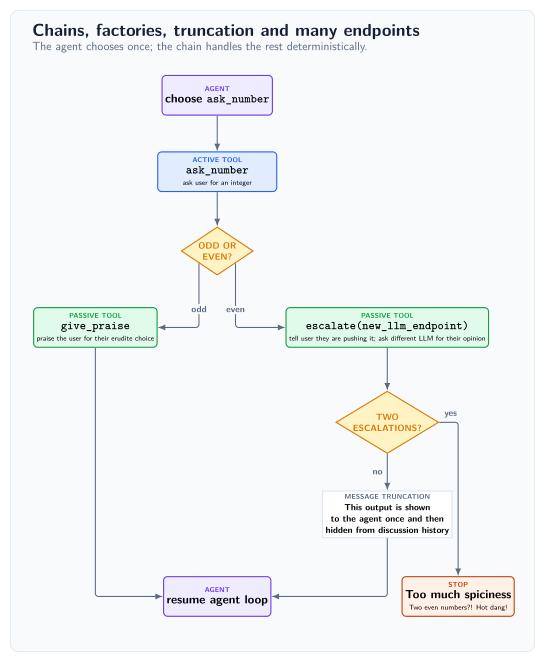

<div align="center">
  <picture>
    <source media="(prefers-color-scheme: dark)" srcset="docs/assets/roboz-logo-dark.svg">
    <source media="(prefers-color-scheme: light)" srcset="docs/assets/roboz-logo-light.svg">
    
  </picture>

  <p><strong>Chain tools. Skip calls.</strong></p>
</div>

RoboZ is a framework for building llm powered agents. The core ingredient is that every tool can may be chained conditionally to a subsequent tool thus allowing easy injection of deterministic flows into agentic processes.

[](https://github.com/Tachion-Oy/roboz/actions/workflows/ci.yml)
[](https://www.python.org/downloads/)
[](LICENSE)

> [!WARNING]
> RoboZ is pre-release software requiring Python 3.13 or newer. APIs may change
> before 1.0.

## Basic idea


### Problems to solve: Context bloat and too many llm calls
Suppose the task we want to achieve is ask our buddy Bob out to lunch and then book a table. For the sake of argument assume that our agent has access to the following MCP servers (Note: this is an example, RoboZ has native Tool primitives):

- Ask Bob what they want
- Find a restaurant
- Book a table.

In the usual approach an agent is presented each MCP server separately in the their system prompt and it must call them one-by-one to complete the task. When the agent is completing the task, at every turn it must choose the correct tool, formulate its output accordingly and absorb the reply into its context, which already must contain the specific instructions on how to use each tool. In addition, at each turn one has to wait for the llm to reply, each reply costs tokens and each reply risks a mistake from the llm.

### Deterministic chains
The philosophy in RoboZ is that the workflow is deterministic an only choosing when to initiate is the agent's job. In RoboZ the agent would trigger the "ask Bob if they wan to have lunch" tool and all subsequent steps come by chaining: each tool is can be chained to other tools upstream where their outputs are passed down the chain. Each link/edge may introduce a True/False condition, in our case for example if Bob interested in having lunch (with us). If he is not, RoboZ allows for the chain to break and returns back to the default tool, which for an agentic process is usually "ask the llm what to do next". The default mode is that chained tools are not presented to the agent, they are thus *passive* or in other words their role is strictly in forming deterministic workflows and they cannot be invoked.

Chaining not only reduces the llm calls, but it also provides a useful way of introducing a fine-grained guard layer for tool calls. This is in fact precisely how the cli tools and their access policies work in Roboz. For a cli command a chained passive tool evaluates the intent and breaks the chain if policies are violated.


## Start here: Agent with a tool

```python
from random import choice

from simpsons_quotes import QUOTES

from roboz import Agent, tool
from roboz.llm.endpoints import MockLLMEndpoint
from roboz.models import Empty, Message, Stop


@tool
def get_quote(input: Empty, messages: list[Message]) -> Stop:
    """Return a random Simpsons quote and then stop."""
    return Stop(value=choice(QUOTES))


mock = MockLLMEndpoint(
    responses=[{"action": "get_quote", "rationale": "Need Simpsons quote!"}]
)

agent = Agent(
    name="demo",
    system_prompt="You are a Simpsons quote generator",
    agent_endpoint=mock,
    tools=[get_quote],
)

output, messages_ = agent.invoke()
print(f'"{output.value}"')
```

The above [simple example](examples/simple.py) can be run from the root with 

```python
uv run examples/simple.py
```
It creates an agent that returns a random
Simpsons quote. It uses a mock endpoint, with pre-determined replies, so you can run it without API keys.
The main contracts of RoboZ are already visible:

- `@tool` creates an instance of a usable tool for the agent
-  A tool's input and output are typed. Tools also receive the entire message stack
- Callable endpoints are single instances, as a hard rule 
- The output `Stop` breaks out of the agentic loop
- `agent.invoke()` runs the agent and returns its output `Stop` and messages.

## Why is this framework useful?

As a concise list the main features can be summarized as

### Tool Chaining
This may be used to reduce the number of llm calls, leading to a speed increase, lower cost and fewer AI errors. It also provides a useful way of introducing a guard layer for tool calls, which can be  used restrict agentic actions.
### Output Truncation
A Tools output can be hidden from the llm, also partially, and this can start to apply after the message has been shown N times.
### Everything that happends is a tool call.
They abstraction that Roboz rests on is that an agent is a loop making tool calls i.e. everything that happens is a tool. This provides a unified contract for all actions: they are tool calls and obey the tools set protocols, no if's or buts.
### Tool outputs are typed.
The contract in RoboZ is that all tool calls and hence in everything that happens is that outputs are typed classes. Agents and tools never excahnge raw strings or even JSON, typed classes and validation are present throughout.
### LLm Endpoints are instances
As strict design rule in Roboz, everything that depends on an LLM call must be trivially swappable to another provider or model. This makes changing an agent endpoint trivial and furthermore multi-endpoint functionality, where inside a single agent several endpoints are implemented, quite easy.

The [simple example](examples/simple.py) above does not illustrate how these more useful features of RoboZ work. For that see [complex example](examples/complex.py) example below.


## Chains, factories, truncation and many endpoints
```python
from builtins import input as read_input

from roboz import Agent, factory, tool
from roboz.llm import EndpointLike, MockLLMEndpoint, get_completion
from roboz.models import Empty, Int, Message, Role, Stop, Str, filter_messages
from roboz.models.truncation import Severity, Truncation
from roboz.runtime.io import interact_with_user
from roboz.runtime.sinks import CliSink
from roboz.tools import stop


@tool
def ask_number(input: Empty, messages: list[Message]) -> Int:
    """Ask the user for an integer, repeating until the response is valid."""
    while True:
        reply = read_input("Enter an integer: ")
        try:
            return Int(value=int(reply))
        except ValueError:
            print("Please enter an integer :)")


@factory(chained_to=ask_number, chain_condition=lambda x: x.value % 2 == 0)
def escalate(input: Int, messages: list[Message], ctx: EndpointLike) -> Stop | Str:
    """An even number?! Need to check this with HR!"""
    interact_with_user("Careful now, that is pretty spicy!", with_reply=False)
    prompt = f"The user chose {input.value}. Is this too hot to handle?! (y/n)?"
    verdict = get_completion(
        endpoint=ctx, messages=[Message(role=Role.SYSTEM, content=prompt)]
    )
    is_first_escalation = (
        len(filter_messages(caller="escalate", messages=messages)) == 0
    )
    if verdict == "y" and not is_first_escalation:
        return Stop(value="Too much spiciness, need to quit!")
    return Str(
        value="HR gave a pass, but still, let's show this to the agent only once.",
        truncation=Truncation(threshold=1, severity=Severity.REMOVE),
    )


@tool(chained_to=ask_number, chain_condition=lambda x: x.value % 2 != 0)
def give_praise(input: Int, messages: list[Message]) -> Str:
    """We need to give praise for such an erudite approach to the problem."""
    interact_with_user(f"{input.value} a fine and bold choice!", with_reply=False)
    return Str(value=f"{input.value} is good, no biggie.")


agent_endpoint = MockLLMEndpoint(
    responses=[
        *(10 * [{"action": "ask_number", "rationale": "This is my only job"}]),
        {"action": "stop", "rationale": "Enough numbers!", "value": ""},
    ]
)
guard_endpoint = MockLLMEndpoint(responses=10 * ["y"])

agent = Agent(
    name="demo",
    system_prompt=f"Without exception, use the {ask_number.name} tool.",
    event_sinks=[CliSink.default()],
    agent_endpoint=agent_endpoint,
    tools=[ask_number, escalate(guard_endpoint), give_praise, stop],
)
agent.invoke()


```

This more realistic example contains much of why RoboZ is useful. The workflow is as follows:
- user chooses number
- number is odd user gets a message and loop returns back to the agent
- number is even, the choice is run by another llm.
- if there are two escalations the process stops


## Try it

```bash
uv add roboz
```

Or with pip:

```bash
python -m pip install roboz
```

The complete [quick start](examples/quickstart.py) uses a deterministic mock
endpoint. Bob first chooses sushi; when no seats are available, the typed chain
retries the planner, routes his second choice to pizza, and books—all from one
model-selected entry into the chain and without credentials:

```bash
uv run python examples/quickstart.py
```

For an unpublished checkout, first run `uv sync --locked --dev`. PyPI commands
require a published release; see the [build and test guide](docs/build-and-test.md)
for local wheels.

## Control what reaches the model

Context is a projection, not an ever-growing transcript. Every `Message` can
carry a lifecycle policy: keep an output intact while it is recent, reduce it
to a stub later, and remove it from model context when it is stale.
`NO_MESSAGE` keeps operational chatter out of model context immediately. These
policies affect only what the model sees; runtime events and persisted messages
retain the full record.

The prompt is not assembled behind an opaque stack of framework layers. The
complete generated system prompt is available before invocation:

```python
print(agent.full_system_prompt)
```

## One execution abstraction

Roboz uses tools for work and for orchestration instead of adding a separate
hook mechanism for each new concern.

| Concern | Roboz abstraction |
| --- | --- |
| A model-selectable action | Active `@tool` |
| A deterministic follow-up | Passive chained tool |
| Runtime configuration or dependencies | `@factory` bound to a concrete typed object |
| Startup, preflight, and default flow | `default_tools` |
| Synchronous delegation | A subagent exposed as a named tool |
| Background work | An idempotent background-start tool in the default flow |

Tools remain independently testable callables with typed inputs and outputs.
An agent's dependency view is derived from this same tool graph rather than a
second registry.

## Put models where they belong

Each agent owns its endpoint. A model-backed factory can bind another endpoint
directly, so a planner, specialist, summarizer, or transcription tool does not
have to share a model merely because it belongs to the same workflow.
`LLMEndpointRoute` follows a typed endpoint getter when a tool or agent should
track live model selection; concrete endpoints keep other uses fixed.

For an individual model call inside a factory, bind its endpoint directly and use
`get_completion(endpoint=ctx, messages=messages)` from `roboz.llm`. It returns raw
text by default, ready for the tool to process. Pass `LlmOutputModel=...` for
validated JSON dictionaries and output repair. See the
[completion guide](docs/tool-authoring.md#standalone-llm-backed-tools) and
[model-backed chain example](examples/chain_with_factory.py).

Provider SDKs remain outside core. The `roboz` package supplies the agent,
tooling, model, runtime, persistence, dependency, and deployment primitives;
install integrations only where they are needed.

## Core primitives

| Primitive | Role |
| --- | --- |
| `roboz.Agent` | Owns the active tool surface, prompt, invoke loop, and runtime events. |
| `roboz.tool` | Defines an action with typed input and output models. |
| `roboz.factory` | Binds a concrete typed context or resource to a tool. |
| `roboz.Skill` | Packages reusable instructions and optional tools. |
| `roboz.models.Message` | Carries content and its model-context lifecycle. |
| `roboz.deployment.DeployableAgent` | Composes capabilities, subagents, and background agents. |

## Optional ecosystem

Start with core and add only the integrations the application needs.

| Distribution | Adds |
| --- | --- |
| `roboshed` | Guarded file and CLI tools, memory, compaction, reusable agents, and deployment recipes. |
| `roboz-endpoints` | Lazy model catalogues and SDK adapters for OpenAI-compatible providers. |
| `roboz-proton-bridge` | Proton Bridge email tools. |

See the [add-on guide](docs/addons.md) for installation and composition, and the
[endpoint guide](packages/endpoints/README.md) for model selection and provider
adapters.

## Documentation

| Guide | Start here for |
| --- | --- |
| [Tool authoring](docs/tool-authoring.md) | Chaining, factories, conditions, and typed handoffs |
| [Agent authoring](docs/agent-authoring.md) | Agent composition and prompt policy |
| [Reference](docs/reference.md) | Runtime and API semantics |
| [Message truncation example](examples/message_truncation.py) | Sliding model-context visibility |
| [Testing practices](docs/testing-practices.md) | Deterministic workflow and contract tests |

## Development

```bash
uv sync --locked --dev
uv run pytest
uv run ruff check
uv run pyright
bash scripts/run_type_tests.sh
```

See [CONTRIBUTING.md](CONTRIBUTING.md) and the
[build and test guide](docs/build-and-test.md) for the complete release gate.
Roboz is typed and ships a PEP 561 `py.typed` marker.

## License

Roboz is licensed under the [Apache License 2.0](LICENSE). Copyright © 2026 Tachion Oy.
