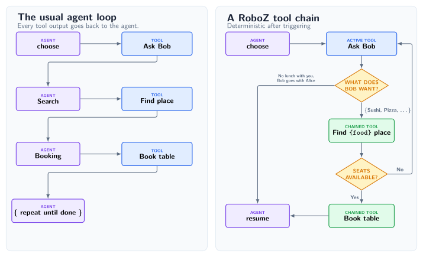

# Roboz

**Chain tools. Skip model calls.**

Roboz lets a model select an active tool, then routes its typed output through
ordinary Python. Conditional branches, follow-up work, and termination do not
have to go back through the agent loop.



[](https://github.com/Tachion-Oy/roboz/actions/workflows/ci.yml)
[](https://www.python.org/downloads/)
[](LICENSE)

> [!WARNING]
> Roboz is pre-release software requiring Python 3.13 or newer. APIs may change
> before 1.0.

## Tool chaining is the point

The model sees and selects **active tools**. A tool with `chained_to` is
**passive**: its schema and instructions stay outside the model's active tool
surface, and Roboz can run it directly from its parent's output.

At each handoff, an ordinary Python predicate can select one successor. Paths
can branch by output type or value, consult application policy, and converge on
a shared tool. Pydantic validates the runtime handoff, while the type checker
catches incompatible links before the agent runs.

```python
import roboz as rz


class LunchPreference(rz.Empty):
    cuisine: str | None


class Restaurant(rz.Empty):
    name: str
    seats_available: bool


class Booking(rz.Empty):
    confirmation: str


@rz.tool
def plan_lunch_with_bob(
    input: rz.Empty, messages: list[rz.Message]
) -> LunchPreference:
    ...


@rz.tool
def retry_plan_lunch_with_bob(
    input: Restaurant, messages: list[rz.Message]
) -> LunchPreference:
    ...


@rz.tool(
    chained_to=[plan_lunch_with_bob, retry_plan_lunch_with_bob],
    chain_condition=lambda output: (
        isinstance(output, LunchPreference)
        and output.cuisine is not None
    ),
)
def find_restaurant(
    input: LunchPreference, messages: list[rz.Message]
) -> Restaurant:
    ...


retry_plan_lunch_with_bob.chain(
    chained_to=find_restaurant,
    chain_condition=lambda output: (
        isinstance(output, Restaurant) and not output.seats_available
    ),
)


@rz.tool(
    chained_to=find_restaurant,
    chain_condition=lambda output: (
        isinstance(output, Restaurant) and output.seats_available
    ),
)
def book_a_table(input: Restaurant, messages: list[rz.Message]) -> Booking:
    ...
```

That changes three practical things:

- **Fewer model calls.** When code already knows the next step, no model has to
  choose it again.
- **Less context bloat.** Passive tool descriptions and schemas never enter the
  active tool surface.
- **Explicit control flow.** Conditions are normal, deterministic Python that
  can be read, tested, and type-checked.

If Bob wants no lunch, no cuisine branch matches and the agent resumes.
Otherwise, his preference becomes the typed argument to one restaurant search.
Available seats flow directly to booking; no seats flow through the passive
retry planner and back into the same search, still without another model
decision. Returning `Stop` would end the run instead; several matching
conditions raise rather than create an ambiguous path.

## Try it

```bash
uv add roboz
```

Or with pip:

```bash
python -m pip install roboz
```

The complete [quick start](examples/quickstart.py) uses a deterministic mock
endpoint. Bob first chooses sushi; when no seats are available, the typed chain
retries the planner, routes his second choice to pizza, and books—all from one
model-selected entry into the chain and without credentials:

```bash
uv run python examples/quickstart.py
```

For an unpublished checkout, first run `uv sync --locked --dev`. PyPI commands
require a published release; see the [build and test guide](docs/build-and-test.md)
for local wheels.

## Control what reaches the model

Context is a projection, not an ever-growing transcript. Every `Message` can
carry a lifecycle policy: keep an output intact while it is recent, reduce it
to a stub later, and remove it from model context when it is stale.
`NO_MESSAGE` keeps operational chatter out of model context immediately. These
policies affect only what the model sees; runtime events and persisted messages
retain the full record.

The prompt is not assembled behind an opaque stack of framework layers. The
complete generated system prompt is available before invocation:

```python
print(agent.full_system_prompt)
```

## One execution abstraction

Roboz uses tools for work and for orchestration instead of adding a separate
hook mechanism for each new concern.

| Concern | Roboz abstraction |
| --- | --- |
| A model-selectable action | Active `@tool` |
| A deterministic follow-up | Passive chained tool |
| Runtime configuration or dependencies | `@factory` bound with `Ctx` |
| Startup, preflight, and default flow | `default_tools` |
| Synchronous delegation | A subagent exposed as a named tool |
| Background work | An idempotent background-start tool in the default flow |

Tools remain independently testable callables with typed inputs and outputs.
An agent's dependency view is derived from this same tool graph rather than a
second registry.

## Put models where they belong

Each agent owns its endpoint. A model-backed factory can bind another endpoint
through `Ctx`, so a planner, specialist, summarizer, or transcription tool does
not have to share a model merely because it belongs to the same workflow. Lazy
endpoint references keep model selection inspectable without constructing
clients early.

Provider SDKs remain outside core. The `roboz` package supplies the agent,
tooling, model, runtime, persistence, dependency, and deployment primitives;
install integrations only where they are needed.

## Core primitives

| Primitive | Role |
| --- | --- |
| `rz.Agent` | Owns the active tool surface, prompt, invoke loop, and runtime events. |
| `@rz.tool` | Defines an action with typed input and output models. |
| `@rz.factory` and `rz.Ctx` | Bind configuration and external dependencies to a tool. |
| `rz.Skill` | Packages reusable instructions and optional tools. |
| `rz.Message` | Carries content and its model-context lifecycle. |
| `roboz.deployment.DeployableAgent` | Composes capabilities, subagents, and background agents. |

## Optional ecosystem

Start with core and add only the integrations the application needs.

| Distribution | Adds |
| --- | --- |
| `roboshed` | Guarded file and CLI tools, memory, compaction, reusable agents, and deployment recipes. |
| `roboz-endpoints` | Lazy model catalogues and SDK adapters for OpenAI-compatible providers. |
| `roboz-proton-bridge` | Proton Bridge email tools. |

See the [add-on guide](docs/addons.md) for installation and composition, and the
[endpoint guide](packages/endpoints/README.md) for model selection and provider
adapters.

## Documentation

| Guide | Start here for |
| --- | --- |
| [Tool authoring](docs/tool-authoring.md) | Chaining, factories, conditions, and typed handoffs |
| [Agent authoring](docs/agent-authoring.md) | Agent composition and prompt policy |
| [Reference](docs/reference.md) | Runtime and API semantics |
| [Message truncation example](examples/message_truncation.py) | Sliding model-context visibility |
| [Testing practices](docs/testing-practices.md) | Deterministic workflow and contract tests |

## Development

```bash
uv sync --locked --dev
uv run pytest
uv run ruff check
uv run pyright
bash scripts/run_type_tests.sh
```

See [CONTRIBUTING.md](CONTRIBUTING.md) and the
[build and test guide](docs/build-and-test.md) for the complete release gate.
Roboz is typed and ships a PEP 561 `py.typed` marker.

## License

Roboz is licensed under the [Apache License 2.0](LICENSE). Copyright © 2026 Tachion Oy.
